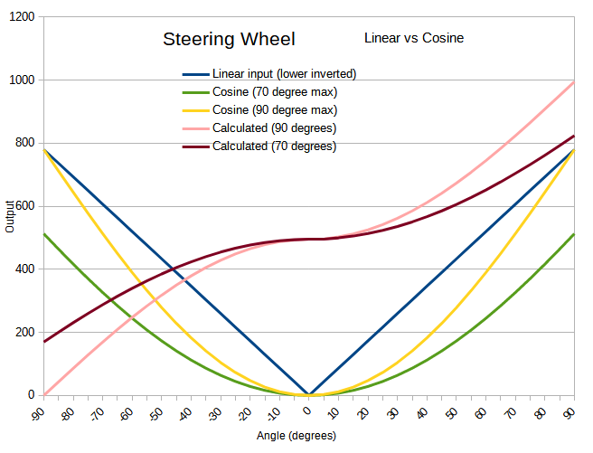

# MadCatz-MC2-USB
## Use an Arduino Pro Micro to repurpose the  Mad Catz MC2 steering wheel/pedal set to USB 
## Features
### Now with Cosine scaling of the steering wheel input! 
Even though the steering wheel seems to move +/- 135degrees, if you take the steering wheel value and cosine scale it between +/-90 degrees, you get a steering wheel that has less input in the center and increasing input closer to the ends of travel. 
The software now has a default of 70 degrees which is settable in the calibration menu (access with a serial terminal "h" for help menu). 
70 degrees further dampens the steering in the center section, with the tradeoff of not full steering output at wheel lock.
**PLEASE NOTE: If you calibrate your steering wheel in windows, it will take the lower signals as the max and will scale it back up to look like the 90 degree graph. 
Therefore, do *not* scale the steering wheel in windows.** 
The accelerator has a 1.2 multiplier on it so calibrating that would be bad also. 

## Wiring
The wiring is included as comments at the top of main.cpp. 
This requires **major** rewiring of your wheel.  You will remove the stock circuit board. 
**Your MadCatz MC2 will no longer work with XBox/PS2/N64.** 
Due to IO limitations, not all buttons are functional.  The LED bar graph is not connected. 
I inverted the +5v and ground lines to the steering pot and the brake and accelerator pots to get them to provide 0V when fully left (or not depressed) and max signal when fully right (or depressed fully). 
The signals from the A,B,X,Y buttons are much lower than expected (1.5V when it should be 5V). As such, the buttons don't *always* behave as expected. I may tear into the wheel and see what is going on later.
## Software
The code is compiled in Visual Studio Code with PlatformIO. 
I use the library [ArduinoJoystickLibrary](https://github.com/MHeironimus/ArduinoJoystickLibrary.git) by Matthew Heironimus
